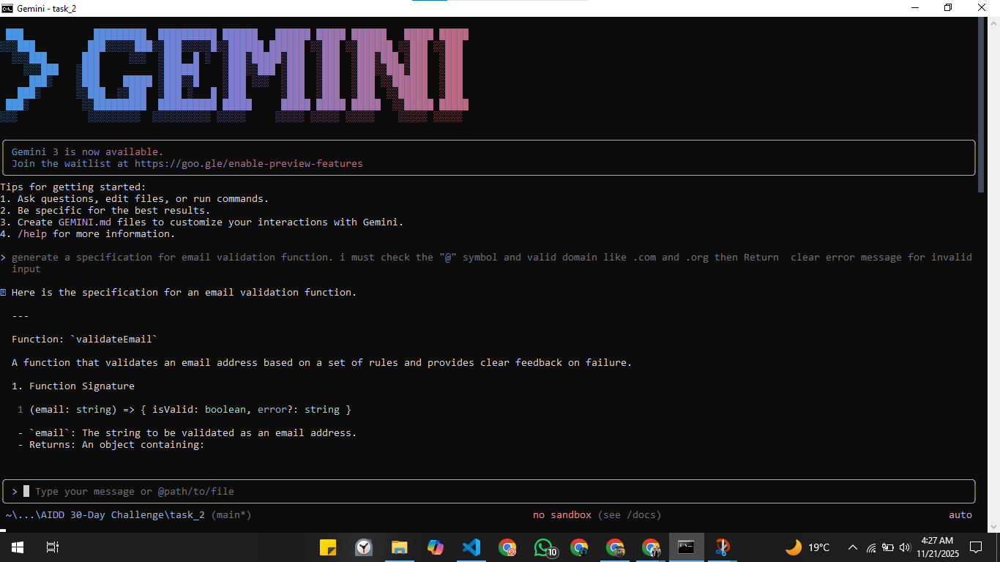
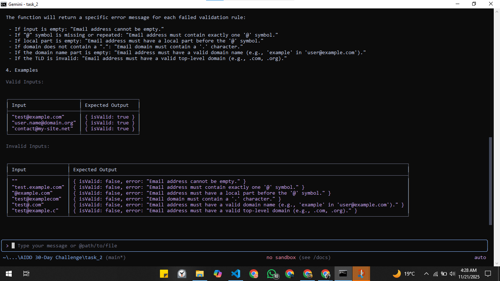

<h1> AI-Driven Development: Task 2</h1>

<h3>Part A — Theory</h3>

<h4>1. Nine Pillars Understanding</h4>

**Q1: Why is using AI Development Agents (like Gemini CLI) for repetitive setup tasks better for your growth as a system architect?**

Using AI agents for repeat and boring setup tasks saves my time. I don’t waste energy on the same steps again and again. This helps me focus more on system structure, planning, and full workflow instead of small commands. So I grow more like a system architect, not just a normal coder.

**Q2: How do the Nine Pillars help a developer grow into an M-Shaped Developer?**

Nine Pillars make the whole work system very fast and systematic. Because of these pillars, one developer can handle multiple types of tasks at the same time — like testing, planning, coding, agents, and automation. Normally, 5 different developers are needed for different roles, but now one person with knowledge + these pillars can do all of this. That’s why a person becomes an M-Shaped Developer — strong in multiple domains, not just one.

<h4>Vibe Coding vs Specification-Driven Development</h4>

**Q1: Why does Vibe Coding usually create problems after one week?**

Vibe coding is fast for small projects but after some days it becomes a problem. When we add new features or try to scale it, then the messy code, no structure, and no proper documentation makes everything difficult. We forget why we wrote something and the project becomes hard to manage.

**Q2: How would Specification-Driven Development prevent those problems?**

SDD tells us to write clear rules before coding. So the code follows a proper direction and structure. When we come back after days or weeks, we know why the function was made and how it works. This keeps the project clean, organized, and easy to grow.

<h4>3.Architecture Thinking</h4>

**Q1: How does architecture-first thinking change the role of a developer in AIDD?**

In AIDD, the developer becomes more like an orchestrator. Instead of writing every small line of code, the developer gives commands, plans the system, and manages the overall structure. The main focus becomes planning, organizing, and making the project scalable.

**Q2: Why must developers think in layers and systems instead of raw code?**

Thinking in layers keeps everything clean and understandable. Modern projects have models, tools, agents, testing, and workflows. If we only think about raw code, the system becomes confusing. Layers make the project easy to upgrade, easy to fix, and easy to scale.

<h2>Part B — Practical Task (With Screenshot)</h2>

Task:

Using any AI CLI tool, generate a 1-paragraph specification for an email validation function.

My Exact CLI Prompt:

Generate a specification for an email validation function that checks @ symbol, valid domain like .com or .org, and return clear error messages

Specification Generated by the CLI:

