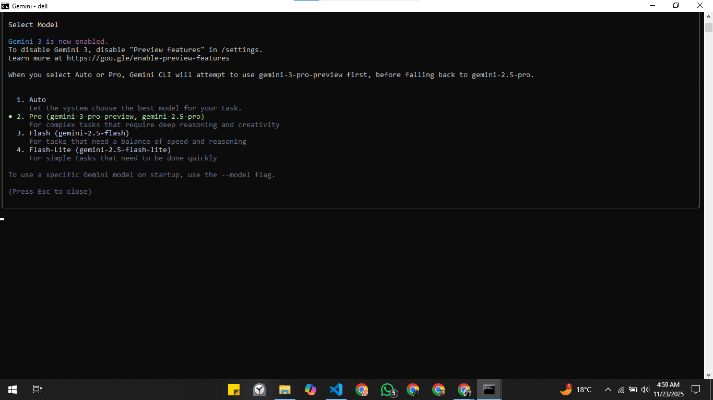

<h1>PART A — Research Questions (Short Answers) </h1>

**1. What new improvements were introduced in Gemini 3.0? (Research and write short answer)**
Much stronger reasoning
Advanced multimodal understanding
Improved coding (“vibe coding”) and agentic capabilities
New “Deep Think” mode
New user interfaces (“generative interfaces”)
Redesigned Gemini app
Stronger safety & security
Integrated rollout across Google products

In short: Gemini 3.0 represents a big leap in intelligence — it's more capable at reasoning, understanding multi-modal inputs, writing code, planning, and acting like a real “thought partner.” It also brings a sleeker UI, new safety features, and deeper integration into Google’s ecosystem.

**2. How does Gemini 3.0 improve coding & automation workflows? (Research and write short answer)**
Agentic Coding & Tool Use
Vibe Coding (Natural Language → Code + UI)
New Agent-First Development Environment — Google Antigravity
Better Reasoning for Long-Term Workflows
Integration Into Developers’ Existing Tools
Improved Code Quality & Validation

In summary: Gemini 3.0 significantly boosts coding productivity by acting not just as a code generator, but as an autonomous development partner. Through its agentic coding, powerful planning, ability to run code and validate results, and a new IDE (Antigravity), it streamlines automation workflows and helps developers build more reliably and efficiently.

**3. How does Gemini 3.0 improve multimodal understanding? (Research and write short answer)**
Native Multimodal Architecture
High Performance on Multimodal Benchmarks
Improved Visual & Spatial Reasoning
Generative Interfaces
Long Context Window Aids Multimodal Reasoning
Deep Think Mode

Summary: Gemini 3.0’s multimodal improvements come from being built from the ground up to understand and reason about multiple types of data (text, images, video, audio, code), its strong benchmark performance, spatial reasoning abilities, and the ability to generate rich visual interfaces. These make its multimodal capabilities much more powerful and flexible than prior versions.

**4. Name any two developer tools introduced with Gemini 3.0. (Research and write short answer)**
Google Antigravity — an agent-first development IDE where Gemini agents have direct access to your editor, terminal, and browser to plan, code, and validate tasks. 

Gemini CLI — a command-line interface that brings Gemini 3 Pro into your terminal, enabling agentic workflows, shell-command generation, and complex task automation.

<h1>PART B — Practical Task (Screenshot Required)</h1>

